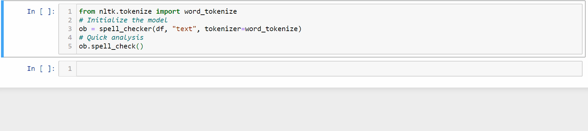
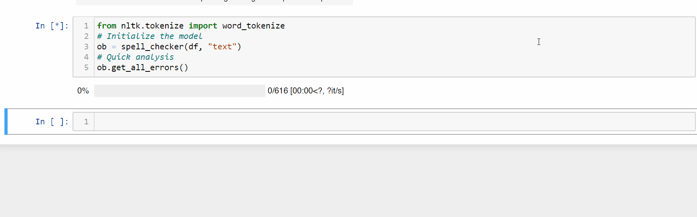

# Manual Spell Checker
A manual spell checker **built on _pyenchant_** that allows you to swiftly correct misspelled words.

## Why does this exist?
While I was working on a text based multi-class classification competition, I noticed that the data contained a lot of misspelled words, errors which automated spell check packages out there couldn't fix. This was because the data had been compiled based on a survey of people who weren't native English speakers. As the there weren't many samples in the dataset (~1000), I decided to write some code for automated detection of spelling errors which I could then fix manually, and thus, this package was born.

## How to install?
```pip install manual_spellchecker```

## How to use it?
### Parameters
- **dataframe** - Takes a pandas dataframe as input
- **column_names** - Pass the column names upon which you want to perform spelling correction
- **tokenizer=None** - Pass your favourite tokenizer like nltk or spacy, etc. (Default: splits on space)
- **num_n_words_dis=5** - This decides how many neighbouring words to display on either side of the error
- **save_path=None** - If a save path is provided, the final corrected dataframe is saved as a csv. (Default: the dataframe is not saved externally)

### Functions
- **spell_check** - Prints the total number of suspected errors
- **get_all_errors** - Returns a list of all the suspected errors
 - **correct_words** - Starts the process of manual correction
 
 **Important Note:** Type -999 into the input box to stop the error correction and save the current progress (is save_path is provided)
 
 **P.S.:** As the package is built on **_pyenchant_**, it also provides suggestions while performing corrections

### How to import?
```python
from manual_spellchecker import spell_checker
```

### Quick analysis of the total number of errors


### Multiple columns can be passed for spelling correction
```python
df = pd.read_csv("Train.csv")
# Initialize the model
ob = spell_checker(df, ["text", "label"])
# Quick analysis
ob.spell_check()
```

### Tokenizers affect the type/number of error(s)



### Get a list of all the errors



### Make corrections


### To save
```python
df = pd.read_csv("Train.csv")
# Initialize the model
ob = spell_checker(df, "text", save_path="correct_train_data.csv")
```

## Future Ideas
- Directly add suggestion from pyenchant when user types in the index of the suggested word
- Will be adding automated, contextual error corrections

## Feature Request
Drop me an email at **atif.hit.hassan@gmail.com** if you want any particular feature
