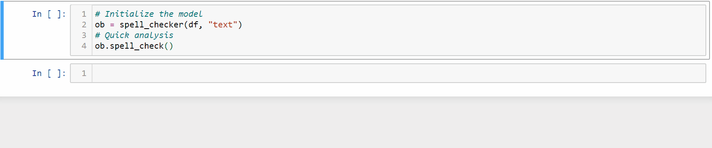
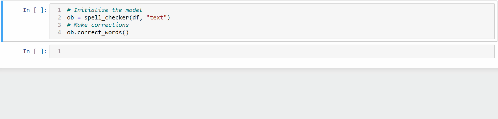

[](https://www.python.org/)
[](https://github.com/atif-hassan/)

[](https://pypi.python.org/pypi/manual-spellchecker/)
[](https://pepy.tech/project/manual-spellchecker)
[](https://github.com/atif-hassan/manual_spellchecker/commits/master)
# Manual Spell Checker
A manual spell checker **built on _pyenchant_** that allows you to swiftly correct misspelled words.

## Why does this exist?
While I was working on a text based multi-class classification competition, I noticed that the data contained a lot of misspelled words, errors which automated spell check packages out there couldn't fix. This was because the data had been compiled based on a survey of people who weren't native English speakers. As the there weren't many samples in the dataset (~1000), I decided to write some code for automated detection of spelling errors which I could then fix manually, and thus, this package was born.

## How to install?
```pip install manual_spellchecker```

## Features
- All features as provided by [pyenchant](https://github.com/pyenchant/pyenchant)
- Quickly analyze and get a list of all misspelled words
- Can replace, skip and delete misspelled words
- Use your favourite tokenizer for splitting words
- Replaced misspelled words via provided suggestions by simply typing in their indices
- Can checkpoint current set of corrections
- Contexualized pretty printing for easy visual correction (works on both command line and notebook)

## Functions and Parameters
```python
# Initialize the spell checking object
__init__(dataframe, column_names, tokenizer=None, num_n_words_dis=5, save_path=None)
```
- **dataframe** - Takes a pandas dataframe as input
- **column_names** - Pass the column name(s) upon which you want to perform spelling correction
- **tokenizer=None** - Pass your favourite tokenizer like nltk or spacy, etc. (Default: splits on space)
- **num_n_words_dis=5** - This decides how many neighbouring words to display on either side of the error
- **save_path=None** - If a save path is provided, the final corrected dataframe is saved as a csv. (Default: the dataframe is not saved but returned)

```python
# For quick analysis of all the misspelled words
spell_check()
```

```python
# Returns a list of all the misspelled words
get_all_errors()
```

```python
# Starts the process of correcting erroneous words
correct_words()
```
 
 **Important Note:**
 - Type -999 into the input box to stop the error correction and save the current progress (if save_path is provided)
 - Simply press enter if you want to skip the current word
 - Type in "" or '' in the input box to delete a misspelled word

## Usage
### How to import?
```python
from manual_spellchecker import spell_checker
```

### Quick analysis of the total number of errors
```python
# Read the data
df = pd.read_csv("Train.csv")
# Initialize the model
ob = spell_checker(df, "text")
# Quick analysis
ob.spell_check()
```


### Multiple columns can be passed for spelling correction
```python
# Read the data
df = pd.read_csv("Train.csv")
# Initialize the model
ob = spell_checker(df, ["text", "label"])
# Quick analysis
ob.spell_check()
```

### You can pass your own tokenizers
```python
# Import nltk's word tokenizer
from nltk import word_tokenize
# Read the data
df = pd.read_csv("Train.csv")
# Initialize the model
ob = spell_checker(df, "text", word_tokenize)
# Quick analysis
ob.spell_check()
```

### Get a list of all the errors
```python
# Read the data
df = pd.read_csv("Train.csv")
# Initialize the model
ob = spell_checker(df, "text")
# Quick analysis. This needs to be performed before getting all errors
ob.spell_check()
# Returns a list of all errors
ob.get_all_errors()
```

### Make corrections
```python
# Read the data
df = pd.read_csv("Train.csv")
# Initialize the model
ob = spell_checker(df, "text")
# Start corrections
ob.correct_words()
```


### To save
```python
df = pd.read_csv("Train.csv")
# Initialize the model
ob = spell_checker(df, "text", save_path="correct_train_data.csv")
```

## Future Ideas
- Will be adding automated, contextual error corrections

## Feature Request
Drop me an email at **atif.hit.hassan@gmail.com** if you want any particular feature
